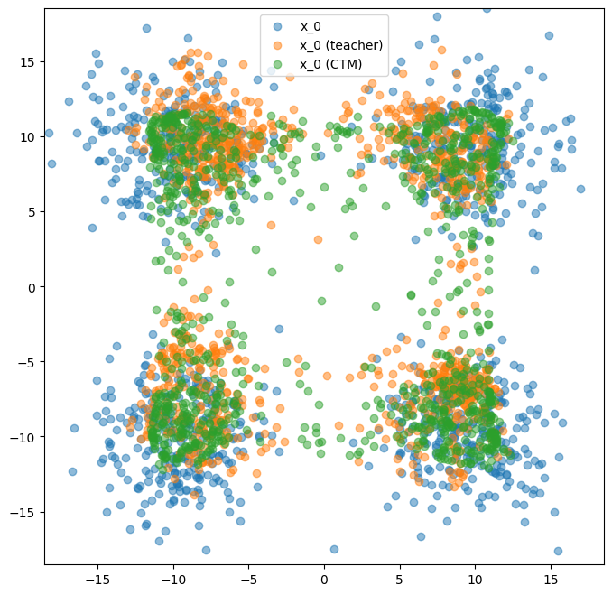
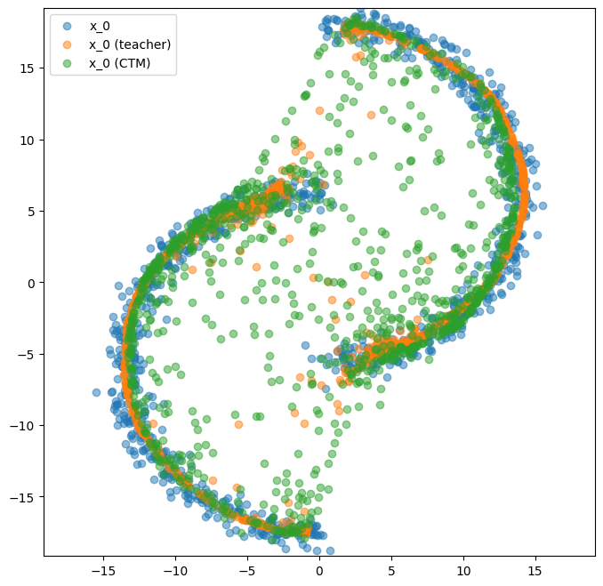

# toy-ctm

Toy example of consistency trajectory model (CTM)

## Requirements

```sh
pip install -r requirements.txt
```

## How to run

```sh
python main.py
```

## Generated samples

<figure>

</figure>

<figure>

</figure>
